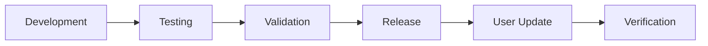

# Update Deployment Strategy for Claude-Ops

## Overview

This document outlines the strategy for deploying updates to multiple Claude-Ops users (~10 team members) while maintaining stability and minimizing disruption.

## 🎯 Update Philosophy

- **Stability First**: Test all updates before team-wide deployment
- **User Autonomy**: Users control when they update their instances
- **Backward Compatibility**: Maintain compatibility when possible
- **Clear Communication**: Document all changes and breaking updates

## 📊 Update Tiers

### Tier 1: Development (Main Branch)
- **Frequency**: Continuous
- **Audience**: Maintainers and contributors
- **Risk Level**: High
- **Testing**: Minimal

### Tier 2: Testing (Staging)
- **Frequency**: Weekly
- **Audience**: Early adopters, admin
- **Risk Level**: Medium
- **Testing**: Integration tests passed

### Tier 3: Stable (Tagged Releases)
- **Frequency**: Bi-weekly or monthly
- **Audience**: All users
- **Risk Level**: Low
- **Testing**: Full test suite + manual verification

## 🔄 Update Workflow



### 1. Development Phase
```bash
# Developers work on feature branches
git checkout -b feature/new-feature
# Make changes
git commit -m "feat: add new feature"
git push origin feature/new-feature
```

### 2. Testing Phase
```bash
# Admin merges to main for testing
git checkout main
git merge feature/new-feature
git push origin main

# Test on admin instance
git pull origin main
uv sync
# Run tests
uv run pytest
```

### 3. Validation Phase
- Admin tests on personal instance for 2-3 days
- Check for breaking changes
- Verify backward compatibility
- Document any migration steps

### 4. Release Phase
```bash
# Create tagged release
git tag -a v2.1.0 -m "Release v2.1.0: Feature improvements"
git push origin v2.1.0

# Update CHANGELOG.md
echo "## v2.1.0 - $(date +%Y-%m-%d)" >> CHANGELOG.md
echo "### Added" >> CHANGELOG.md
echo "- New feature description" >> CHANGELOG.md
git commit -am "docs: update changelog for v2.1.0"
git push origin main
```

### 5. User Update Phase
Users receive notification and update at their convenience:
```bash
# Users update to specific version
git fetch --tags
git checkout v2.1.0
uv sync
# Restart bot
```

## 📢 Communication Strategy

### Update Notifications

#### Telegram Channel (Recommended)
Create a dedicated Claude-Ops updates channel:
```
Claude-Ops Updates Channel
- Release announcements
- Breaking changes warnings
- Tips and best practices
```

#### Email List (Alternative)
For teams preferring email:
- Weekly digest of updates
- Critical security updates immediately

### Update Message Template
```markdown
🚀 Claude-Ops Update Available: v2.1.0

**Type**: [Feature/Bugfix/Security]
**Priority**: [Low/Medium/High/Critical]

**What's New:**
- Feature 1: Description
- Fix 1: Description

**Breaking Changes:** [None/Listed below]
- Change 1: Migration required

**Update Instructions:**
```bash
git fetch --tags
git checkout v2.1.0
uv sync
# Restart your bot
```

**Questions?** Contact @admin_username
```

## 🛡️ Safety Measures

### 1. Rollback Plan
Every user should know how to rollback:
```bash
# List available versions
git tag -l

# Rollback to previous version
git checkout v2.0.0
uv sync
# Restart bot
```

### 2. Backup Strategy
Before major updates:
```bash
# Backup current state
cp .env .env.backup
git stash save "pre-update-backup"

# After update, if issues:
git stash pop
cp .env.backup .env
```

### 3. Gradual Rollout
- Day 1-2: Admin only
- Day 3-4: Early adopters (2-3 users)
- Day 5+: All users

## 📋 Update Checklist for Admin

Before releasing an update:

- [ ] All tests pass (`uv run pytest`)
- [ ] CHANGELOG.md updated
- [ ] Breaking changes documented
- [ ] Migration guide written (if needed)
- [ ] Tested on personal instance
- [ ] Version tag created
- [ ] Update notification prepared

## 🔧 Automated Update Script

Create `scripts/check-updates.sh` for users:
```bash
#!/bin/bash

# Check for updates
echo "Checking for Claude-Ops updates..."

# Fetch latest tags
git fetch --tags

# Get current version
current=$(git describe --tags --abbrev=0)

# Get latest version
latest=$(git describe --tags `git rev-list --tags --max-count=1`)

if [ "$current" != "$latest" ]; then
    echo "Update available: $current → $latest"
    echo "Run 'git checkout $latest && uv sync' to update"
else
    echo "You're on the latest version: $current"
fi
```

## 📈 Version Numbering

Follow Semantic Versioning (SemVer):
- **MAJOR.MINOR.PATCH** (e.g., 2.1.0)
- **MAJOR**: Breaking changes
- **MINOR**: New features (backward compatible)
- **PATCH**: Bug fixes

### Examples:
- `2.0.0` → `3.0.0`: Breaking API changes
- `2.0.0` → `2.1.0`: New commands added
- `2.0.0` → `2.0.1`: Bug fixes only

## 🚨 Emergency Updates

For critical security updates:

1. **Immediate Notification**: Alert all users via all channels
2. **Force Update Window**: Set 24-hour deadline
3. **Provide Support**: Be available for update assistance
4. **Track Compliance**: Verify all users updated

Emergency update command:
```bash
# Admin broadcasts to all instances (if implemented)
./scripts/emergency-update.sh "Critical security update v2.0.1 required"
```

## 📊 Update Metrics

Track update adoption:
```python
# scripts/update-metrics.py
import subprocess
import json

def check_user_versions():
    users = [
        {"name": "User1", "repo": "/path/to/user1/claude-ops"},
        {"name": "User2", "repo": "/path/to/user2/claude-ops"},
        # Add all users
    ]
    
    for user in users:
        version = subprocess.check_output(
            ["git", "describe", "--tags"],
            cwd=user["repo"]
        ).decode().strip()
        print(f"{user['name']}: {version}")

if __name__ == "__main__":
    check_user_versions()
```

## 🔄 Continuous Improvement

### Feedback Loop
1. Collect user feedback after each update
2. Address common issues in next release
3. Improve documentation based on questions
4. Refine update process based on experience

### Update Survey Template
```
1. How smooth was the update process? (1-5)
2. Did you encounter any issues?
3. How clear were the update instructions?
4. Suggestions for improvement?
```

## 📚 Migration Guides

For breaking changes, provide detailed migration guides:

### Example Migration Guide (v1.x to v2.0)
```markdown
# Migration Guide: v1.x to v2.0

## Breaking Changes
1. Configuration format changed from JSON to TOML
2. Command syntax updated

## Step-by-Step Migration

### 1. Backup Current Configuration
```bash
cp config.json config.json.backup
```

### 2. Update Code
```bash
git checkout v2.0.0
uv sync
```

### 3. Migrate Configuration
```bash
python scripts/migrate_config.py config.json.backup
```

### 4. Verify and Test
```bash
uv run python -m claude_ops.telegram.bot --test
```
```

## 🎯 Best Practices for Users

1. **Subscribe to update channel**
2. **Test updates in non-critical sessions first**
3. **Keep backups before major updates**
4. **Report issues promptly**
5. **Share successful update experiences**

## 📅 Update Schedule

### Regular Schedule
- **Monday**: Development freeze for weekly release
- **Tuesday**: Testing and validation
- **Wednesday**: Release announcement
- **Thursday-Friday**: User updates
- **Monday (next)**: Feedback collection

### Holiday/Vacation Policy
- No updates during major holidays
- Advance notice for admin absence
- Designated backup admin for emergencies

---

## Quick Reference

### For Admin
```bash
# Test update
git pull origin main
uv run pytest

# Create release
git tag -a v2.1.0 -m "Release description"
git push origin v2.1.0

# Notify users
./scripts/notify-update.sh v2.1.0
```

### For Users
```bash
# Check for updates
git fetch --tags
git describe --tags  # Current version
git tag -l  # All versions

# Update to latest
git checkout $(git describe --tags `git rev-list --tags --max-count=1`)
uv sync

# Rollback if needed
git checkout v2.0.0  # Previous version
uv sync
```

---

*Last Updated: 2024*
*Version: 1.0.0*